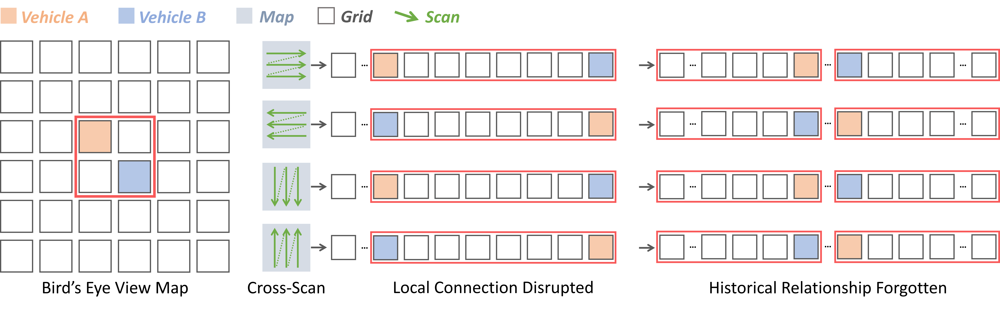
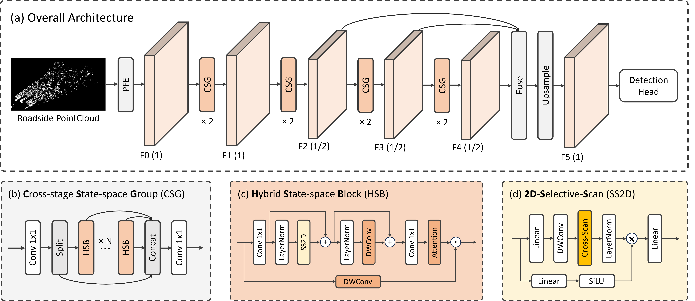

<p align="center">

  <h1 align="center">PillarMamba: Learning Local-Global Context for Roadside Point
Cloud via Hybrid State Space Model</h1>
  
  </p>

[](https://opensource.org/licenses/MIT)
[](https://arxiv.org/pdf/2505.05397)
<a href="https://github.com/zhangzhang2024/PillarMamba" target="_blank">
    
</a>

<!-- <p align="center">

</p>
<p align="center">

</p> -->

# Overview

<p align="center">

</p>

As an important component of Intelligent Transportation Systems (ITS) and Vehicle-to-Everything (V2X), roadside point cloud 3D object detection has not received sufficient attention and effective network architecture design. The dense context in roadside point cloud due to the perspective difference in sensor locations motivates us to explore the potential of state space model for roadside scenarios. We address the inefficient computation, local connection disrupted and historical relationship forgotten faced by standard Mamba through the design of Cross-stage State-space Group (CSG) and Hybrid State-space Block (HSB) in roadside point cloud scenarios. Our PillarMamba achieves the state-of-the-art in two real-world roadside point cloud perception benchmarks, DAIR-V2X-I and RCooper.

# Overall Framework

<p align="center">

</p>


## Getting Started
### Installation

#### a. Clone this repository
```shell
https://github.com/zhangzhang2024/PillarMamba && cd PillarMamba
```
#### b. Install the environment

Following the install documents for [OpenPCDet](docs/INSTALL.md) and [MambaIR](https://github.com/csguoh/MambaIR).

#### c. Prepare the datasets. 

Please follow the [Height3D](https://github.com/zhangzhang2024/Height3D/blob/main/docs/prepare_dataset.md) to convert the DAIRV2X-I dataset to Kitti format and follow the [OpenPCDet](https://github.com/open-mmlab/OpenPCDet/blob/master/docs/GETTING_STARTED.md) to convert the Kitti format to PCDet format, then rename it to dair-v2x-kitti-pcdet.

### Training

```shell
# single-gpu
CUDA_VISIBLE_DEVICES=0 python tools/train.py \
    --cfg_file tools/cfgs/dair_models/pillarmamba.yaml  \
    --work_dir /mnt/tmpdata/pillar/pillarmamba/
```

```shell
# multi-gpus
CUDA_VISIBLE_DEVICES=0,1 bash tools/scripts/dist_train.sh 2 \
    --cfg_file tools/cfgs/dair_models/pillarmamba.yaml \
    --work_dir /mnt/tmpdata/pillar/pillarmamba/
```

### Evaluation

```shell
# infer
CUDA_VISIBLE_DEVICES=0 python tools/test.py \
    --cfg_file tools/cfgs/dair_models/pillarmamba.yaml \
    --ckpt /mnt/tmpdata/pillar/pillarmamba/default/ckpt/checkpoint_epoch_80.pth \
    --batch_size 1 --infer_time
```

```shell
# vis
CUDA_VISIBLE_DEVICES=0 python tools/eval.py \
    --cfg_file tools/cfgs/dair_models/pillarmamba.yaml \
    --ckpt /mnt/tmpdata/pillar/pillarmamba/default/ckpt/checkpoint_epoch_80.pth \
    --batch_size 1 --vis_path ./vis_pillarmamba
```

## Citation 
If you find our paper and code useful in your research, please consider giving us a star ⭐ and citing our work 📝 :)

```
@article{zhang2025pillarmamba,
  title={Pillarmamba: Learning local-global context for roadside point cloud via hybrid state space model},
  author={Zhang, Zhang and Sun, Chao and Yue, Chao and Wen, Da and Wang, Tianze and Leng, Jianghao},
  journal={arXiv preprint arXiv:2505.05397},
  year={2025}
}

```

## Acknowledgement
-  This work is built upon the [OpenPCDet](https://github.com/open-mmlab/OpenPCDet), [MambaIR](https://github.com/csguoh/MambaIR) and [Height3D](https://github.com/zhangzhang2024/Height3D). 


<!-- ## License

This project is released under the [Apache 2.0 license](LICENSE). -->
